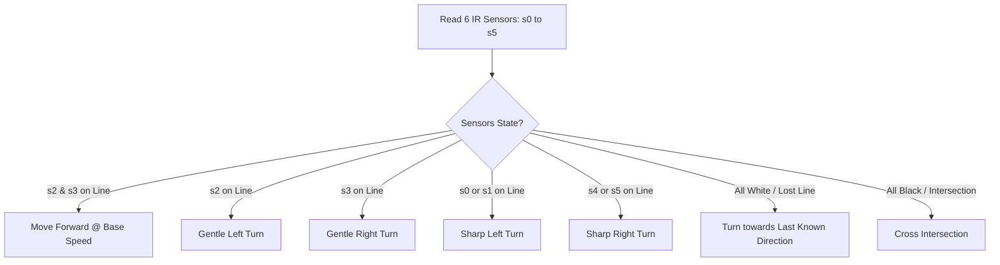

# 🏎️ 6-Sensor Autonomous Line Follower Robot

An intelligent and responsive autonomous line follower robot built using **Arduino Uno/Nano**, a **6-Channel IR Sensor Array**, and an **L298N Motor Driver**. 

This project implements smooth differential steering, dead-zone prevention, and a direction-memory recovery system for sharp corners and track interruptions.

---

## 📸 Highlights & Features

- **6-Channel High-Precision Sensing**: Wide-field line detection using 6 IR sensors for robust tracking.
- **Differential Speed Steering**: Implements gentle turns by modulating motor speed (PWM) rather than abrupt spinning.
- **Memory Recovery System**: If the vehicle loses the line during a sharp bend, it remembers its last steering direction to quickly re-acquire the line.
- **Dead-Zone Prevention**: Logic covers all single and multi-sensor edge cases so the robot never freezes unexpectedly.

---

## 🛠️ Hardware Components

| Component | Quantity | Description |
| :--- | :--- | :--- |
| **Arduino Uno / Nano** | 1 | Microcontroller |
| **6-Channel IR Sensor Module** | 1 | Line detection array (A0 – A5) |
| **L298N Dual H-Bridge Motor Driver** | 1 | DC motor control with PWM speed regulation |
| **BO Gear Motors (3-6V / 100-300 RPM)** | 2 | Left and Right drive motors |
| **Robot Chassis & Wheels** | 1 | 2WD chassis + caster wheel |
| **Power Source** | 1 | 2x 18650 Li-ion batteries (7.4V) or 9V/12V Battery Pack |
| **Jumper Wires & Switch** | - | Connecting wires & power switch |

---

## 🔌 Circuit & Pin Mapping

### 1. IR Sensor Module -> Arduino
| IR Sensor Pin | Arduino Pin | Description |
| :--- | :--- | :--- |
| `OUT 1` | `A0` | Far Left Sensor |
| `OUT 2` | `A1` | Left Sensor |
| `OUT 3` | `A2` | Middle-Left Sensor |
| `OUT 4` | `A3` | Middle-Right Sensor |
| `OUT 5` | `A4` | Right Sensor |
| `OUT 6` | `A5` | Far Right Sensor |
| `VCC` | `5V` | Power Supply |
| `GND` | `GND` | Ground |

### 2. L298N Motor Driver -> Arduino
| L298N Pin | Arduino Pin | Function |
| :--- | :--- | :--- |
| `ENA` | `D5` | Left Motor Speed (PWM) |
| `IN1` | `D8` | Left Motor Direction 1 |
| `IN2` | `D9` | Left Motor Direction 2 |
| `IN3` | `D10` | Right Motor Direction 1 |
| `IN4` | `D11` | Right Motor Direction 2 |
| `ENB` | `D6` | Right Motor Speed (PWM) |
| `GND` | `GND` | Common Ground with Arduino |

> ⚠️ **Important:** Connect the Arduino `GND` and L298N `GND` together to ensure a common reference voltage.

---

## 🧠 Control Logic



---

## 🚀 How to Setup & Flash

1. **Clone the Repository:**
   ```bash
   git clone https://github.com/<your-username>/line-follower-car.git
   ```
2. Open [`line_follower_car/line_follower_car.ino`](line_follower_car/line_follower_car.ino) in the **Arduino IDE**.
3. Select your board (**Tools > Board > Arduino Uno**) and your COM port (**Tools > Port**).
4. Click **Upload** (`Ctrl + U`).

---

## ⚙️ Calibration & Tuning

- **Sensor Thresholds:** Calibrate each sensor's potentiometer so the status LED illuminates precisely when transitioning between white surface and black tape.
- **Motor Speeds:** Modify `BASE_SPEED` (default `140`) and `TURN_SPEED` (default `160`) in the code according to your surface grip and battery voltage.

---

## 📜 License
This project is open-source and available under the [MIT License](LICENSE).
